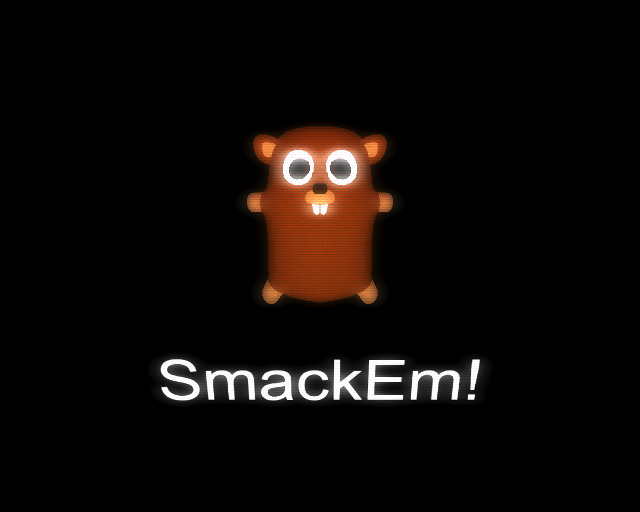

# SmackEm



The front porch owned by Critter Control has been infested though a
coordinated attack by the Mole Hole Gang and things are out
of control.

The Critter Control people look in the address book and search
for Critter Control.. They call but the line is busy. They panic
but wait: Hammer Time!

You get extra time whenever you hit a mole and loose time when you miss.
The more points you have the faster things go.

## Planned but out of time

* The more points you have the more mole holes you will get. Sadly, I only
managed to implement a fixed number of holes
* Cinematic when Critter Control calls their own number
* More mole animations
* High scores
* Better gamification

# Credits

* Font: https://www.dafont.com/comic-andy.font?l[]=10&l[]=1

## Quickstart

```
npm install
npm prod
```

This will compile the assets and start the webserver.

For development, run these commands in different terminals:

```
npm run coffee
npm run sass
npm run server
```
